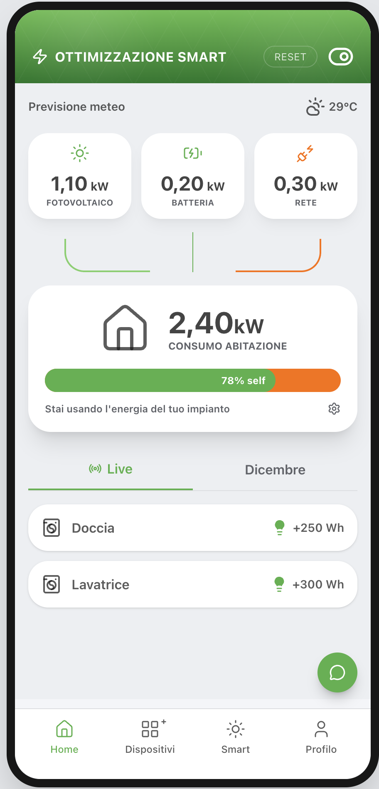
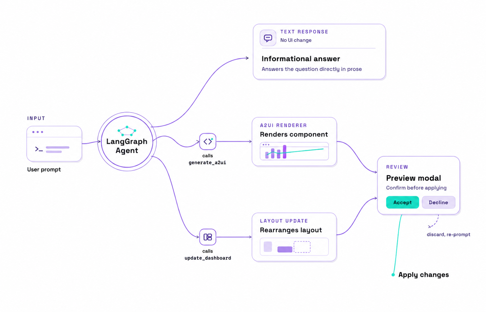
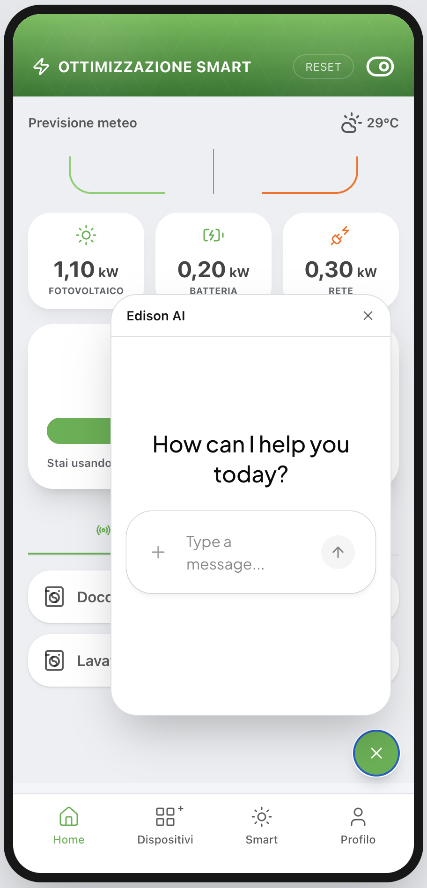
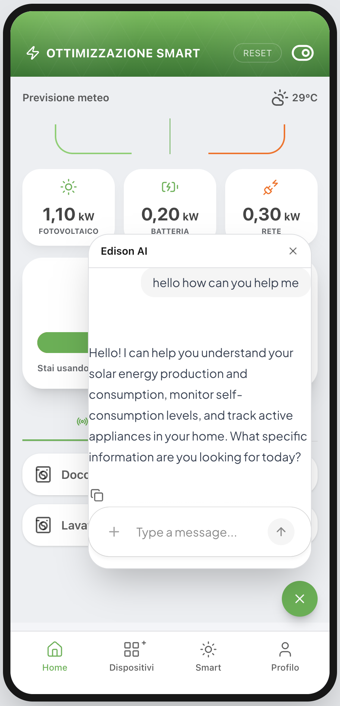
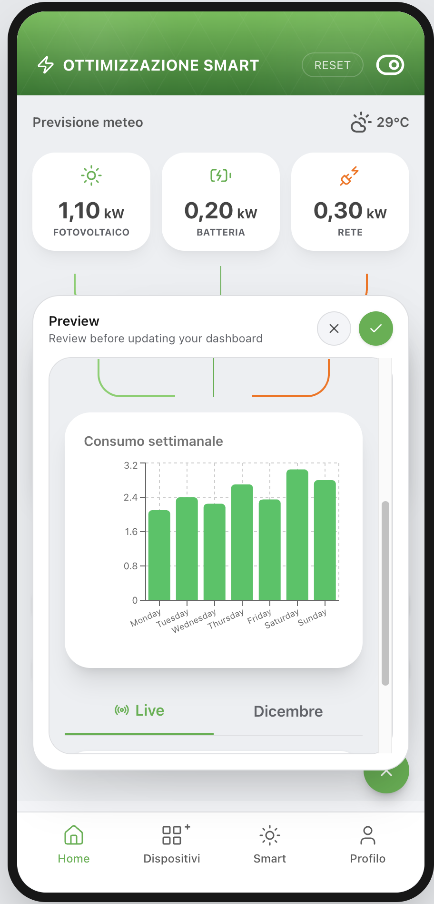
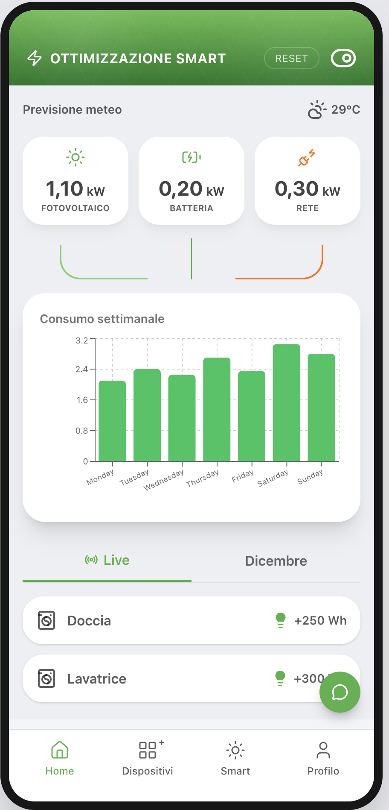

# GIPES: Edison My Sun

This repository contains our work for the GIPES multidisciplinary project, carried out with Edison Energy as our customer. Edison Energy offers My Sun, an app that lets homeowners follow the production and consumption of their solar systems. Throughout the project we worked closely with Edison Energy to understand their users and to explore how new AI technology could make the app more useful for each of them.

## About the Project

At the core of the project is generative UI: user interfaces that are generated dynamically by AI based on the needs of each user. Instead of a fixed set of screens designed in advance, the interface changes to show what the individual user needs at any given moment.

To explore this, we built a mock version of the Edison My Sun app, a solar energy dashboard for homeowners. When a user expresses a need, the AI generates the interface components that best address it, such as a chart comparing energy prices or a view of appliance usage. Two users with different needs can end up with completely different interfaces from the same app.

The dynamic interfaces are built with A2UI, a new open technology developed by Google that lets AI describe user interfaces declaratively, which the app then renders using its own set of trusted components.

  

## How It Works

The user talks to Edison AI, a LangGraph agent, through a chat in the app. For each prompt the agent picks one of three paths:

- **Text response:** it answers the question directly, and the interface stays as it is.
- **New component:** it calls `generate_a2ui` to describe a new component in A2UI, which the app renders with its own components.
- **Layout update:** it calls `update_dashboard` to rearrange the existing dashboard.

Changes to the interface are never applied straight away. The user first sees them in a preview and can accept them, or decline and ask again.

## Screenshots

| Asking Edison AI | Getting an answer | Previewing a change | Change applied |
|:---:|:---:|:---:|:---:|
|  |  |  |  |

## Why Energy Data

Home solar systems produce a lot of data about production, battery, grid usage and consumption, and different homeowners care about very different parts of it. This makes it a good domain for testing whether interfaces that adapt to each user are more useful than a single fixed dashboard.

## Why a Mock App

The prototype uses simulated energy data instead of a real solar installation. This lets us focus on generative UI itself without depending on real hardware or customer data.

## Repository Contents

The application lives in [`my-app/`](my-app/). See [`my-app/README.md`](my-app/README.md) for technical documentation and instructions for running it.
